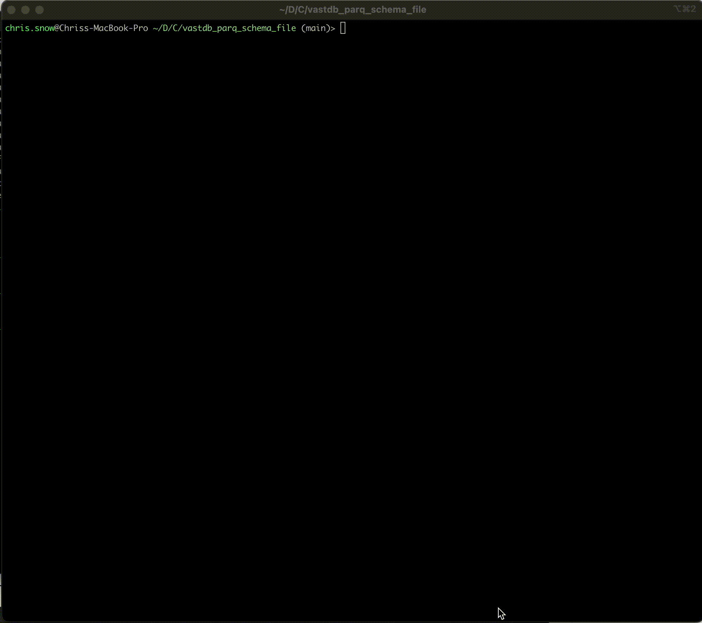
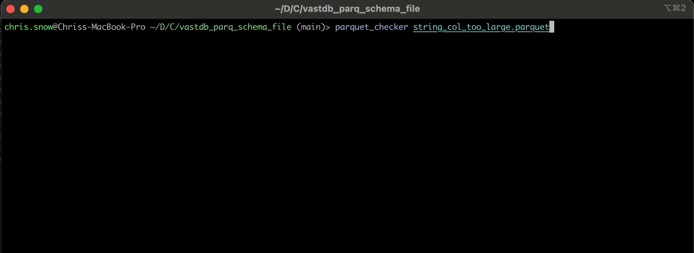

# Vastdb parquet check

Checks if a parquet file can be loaded into Vast DB.

## Limitations

- Currently unable to calculate max column size for nested types (List, Map, Struct).

## Install

```bash
pip3 install --upgrade --quiet git+https://github.com/snowch/vastdb_parq_schema_file.git --use-pep517
```

## Examples

### New York Taxi Data



### Column too wide example:


